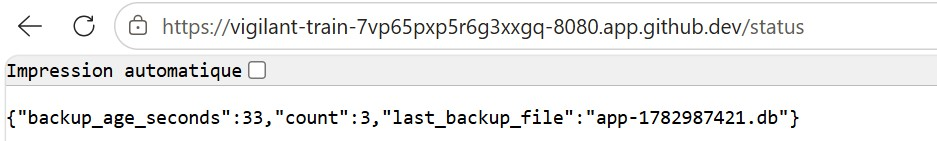

------------------------------------------------------------------------------------------------------
ATELIER PRA/PCA
------------------------------------------------------------------------------------------------------
L’idée en 30 secondes : Cet atelier met en œuvre un **mini-PRA** sur **Kubernetes** en déployant une **application Flask** avec une **base SQLite** stockée sur un **volume persistant (PVC pra-data)** et des **sauvegardes automatiques réalisées chaque minute vers un second volume (PVC pra-backup)** via un **CronJob**. L’**image applicative est construite avec Packer** et le **déploiement orchestré avec Ansible**, tandis que Kubernetes assure la gestion des pods et de la disponibilité applicative. Nous observerons la différence entre **disponibilité** (recréation automatique des pods sans perte de données) et **reprise après sinistre** (perte volontaire du volume de données puis restauration depuis les backups), nous mesurerons concrètement les RTO et RPO, et comprendrons les limites d’un PRA local non répliqué. Cet atelier illustre de manière pratique les principes de continuité et de reprise d’activité, ainsi que le rôle respectif des conteneurs, du stockage persistant et des mécanismes de sauvegarde.
  
**Architecture cible :** Ci-dessous, voici l'architecture cible souhaitée.   
  
  
  
-------------------------------------------------------------------------------------------------------
Séquence 1 : Codespace de Github
-------------------------------------------------------------------------------------------------------
Objectif : Création d'un Codespace Github  
Difficulté : Très facile (~5 minutes)
-------------------------------------------------------------------------------------------------------
**Faites un Fork de ce projet**. Si besoin, voici une vidéo d'accompagnement pour vous aider à "Forker" un Repository Github : [Forker ce projet](https://youtu.be/p33-7XQ29zQ) 
  
Ensuite depuis l'onglet **[CODE]** de votre nouveau Repository, **ouvrez un Codespace Github**.
  
---------------------------------------------------
Séquence 2 : Création du votre environnement de travail
---------------------------------------------------
Objectif : Créer votre environnement de travail  
Difficulté : Simple (~10 minutes)
---------------------------------------------------
Vous allez dans cette séquence mettre en place un cluster Kubernetes K3d contenant un master et 2 workers, installer les logiciels Packer et Ansible. Depuis le terminal de votre Codespace copier/coller les codes ci-dessous étape par étape :  

**Création du cluster K3d**  
```
curl -s https://raw.githubusercontent.com/k3d-io/k3d/main/install.sh | bash
```
```
k3d cluster create pra \
  --servers 1 \
  --agents 2
```
**vérification de la création de votre cluster Kubernetes**  
```
kubectl get nodes
```
**Installation du logiciel Packer (création d'images Docker)**  
```
PACKER_VERSION=1.11.2
curl -fsSL -o /tmp/packer.zip \
  "https://releases.hashicorp.com/packer/${PACKER_VERSION}/packer_${PACKER_VERSION}_linux_amd64.zip"
sudo unzip -o /tmp/packer.zip -d /usr/local/bin
rm -f /tmp/packer.zip
```
**Installation du logiciel Ansible**  
```
python3 -m pip install --user ansible kubernetes PyYAML jinja2
export PATH="$HOME/.local/bin:$PATH"
ansible-galaxy collection install kubernetes.core
```
  
---------------------------------------------------
Séquence 3 : Déploiement de l'infrastructure
---------------------------------------------------
Objectif : Déployer l'infrastructure sur le cluster Kubernetes
Difficulté : Facile (~15 minutes)
---------------------------------------------------  
Nous allons à présent déployer notre infrastructure sur Kubernetes. C'est à dire, créér l'image Docker de notre application Flask avec Packer, déposer l'image dans le cluster Kubernetes et enfin déployer l'infratructure avec Ansible (Création du pod, création des PVC et les scripts des sauvegardes aututomatiques).  

**Création de l'image Docker avec Packer**  
```
packer init .
packer build -var "image_tag=1.0" .
docker images | head
```
  
**Import de l'image Docker dans le cluster Kubernetes**  
```
k3d image import pra/flask-sqlite:1.0 -c pra
```
  
**Déploiment de l'infrastructure dans Kubernetes**  
```
ansible-playbook ansible/playbook.yml
```
  
**Forward du port 8080 qui est le port d'exposition de votre application Flask**  
```
kubectl -n pra port-forward svc/flask 8080:80 >/tmp/web.log 2>&1 &
```
  
---------------------------------------------------  
**Réccupération de l'URL de votre application Flask**. Votre application Flask est déployée sur le cluster K3d. Pour obtenir votre URL cliquez sur l'onglet **[PORTS]** dans votre Codespace (à coté de Terminal) et rendez public votre port 8080 (Visibilité du port). Ouvrez l'URL dans votre navigateur et c'est terminé.  

**Les routes** à votre disposition sont les suivantes :  
1. https://...**/** affichera dans votre navigateur "Bonjour tout le monde !".
2. https://...**/health** pour voir l'état de santé de votre application.
3. https://...**/add?message=test** pour ajouter un message dans votre base de données SQLite.
4. https://...**/count** pour afficher le nombre de messages stockés dans votre base de données SQLite.
5. https://...**/consultation** pour afficher les messages stockés dans votre base de données.
  
---------------------------------------------------  
### Processus de sauvegarde de la BDD SQLite

Grâce à une tâche CRON déployée par Ansible sur le cluster Kubernetes (un CronJob), toutes les minutes une sauvegarde de la BDD SQLite est faite depuis le PVC pra-data vers le PCV pra-backup dans Kubernetes.  

Pour visualiser les sauvegardes périodiques déposées dans le PVC pra-backup, coller les commandes suivantes dans votre terminal Codespace :  

```
kubectl -n pra run debug-backup \
  --rm -it \
  --image=alpine \
  --overrides='
{
  "spec": {
    "containers": [{
      "name": "debug",
      "image": "alpine",
      "command": ["sh"],
      "stdin": true,
      "tty": true,
      "volumeMounts": [{
        "name": "backup",
        "mountPath": "/backup"
      }]
    }],
    "volumes": [{
      "name": "backup",
      "persistentVolumeClaim": {
        "claimName": "pra-backup"
      }
    }]
  }
}'
```
```
ls -lh /backup
```
**Pour sortir du cluster et revenir dans le terminal**
```
exit
```

---------------------------------------------------
Séquence 4 : 💥 Scénarios de crash possibles  
Difficulté : Facile (~30 minutes)
---------------------------------------------------
### 🎬 **Scénario 1 : PCA — Crash du pod**  
Nous allons dans ce scénario **détruire notre Pod Kubernetes**. Ceci simulera par exemple la supression d'un pod accidentellement, ou un pod qui crash, ou un pod redémarré, etc..

**Destruction du pod :** Ci-dessous, la cible de notre scénario   
  
  

Nous perdons donc ici notre application mais pas notre base de données puisque celle-ci est déposée dans le PVC pra-data hors du pod.  

Copier/coller le code suivant dans votre terminal Codespace pour détruire votre pod :
```
kubectl -n pra get pods
```
Notez le nom de votre pod qui est différent pour tout le monde.  
Supprimez votre pod (pensez à remplacer <nom-du-pod-flask> par le nom de votre pod).  
Exemple : kubectl -n pra delete pod flask-7c4fd76955-abcde  
```
kubectl -n pra delete pod <nom-du-pod-flask>
```
**Vérification de la suppression de votre pod**
```
kubectl -n pra get pods
```
👉 **Le pod a été reconstruit sous un autre identifiant**.  
Forward du port 8080 du nouveau service  
```
kubectl -n pra port-forward svc/flask 8080:80 >/tmp/web.log 2>&1 &
```
Observez le résultat en ligne  
https://...**/consultation** -> Vous n'avez perdu aucun message.
  
👉 Kubernetes gère tout seul : Aucun impact sur les données ou sur votre service (PVC conserve la DB et le pod est reconstruit automatiquement) -> **C'est du PCA**. Tout est automatique et il n'y a aucune rupture de service.
  
---------------------------------------------------
### 🎬 **Scénario 2 : PRA - Perte du PVC pra-data** 
Nous allons dans ce scénario **détruire notre PVC pra-data**. C'est à dire nous allons suprimer la base de données en production. Ceci simulera par exemple la corruption de la BDD SQLite, le disque du node perdu, une erreur humaine, etc. 💥 Impact : IL s'agit ici d'un impact important puisque **la BDD est perdue**.  

**Destruction du PVC pra-data :** Ci-dessous, la cible de notre scénario   
  
  

🔥 **PHASE 1 — Simuler le sinistre (perte de la BDD de production)**  
Copier/coller le code suivant dans votre terminal Codespace pour détruire votre base de données :
```
kubectl -n pra scale deployment flask --replicas=0
```
```
kubectl -n pra patch cronjob sqlite-backup -p '{"spec":{"suspend":true}}'
```
```
kubectl -n pra delete job --all
```
```
kubectl -n pra delete pvc pra-data
```
👉 Vous pouvez vérifier votre application en ligne, la base de données est détruite et la service n'est plus accéssible.  

✅ **PHASE 2 — Procédure de restauration**  
Recréer l’infrastructure avec un PVC pra-data vide.  
```
kubectl apply -f k8s/
```
Vérification de votre application en ligne.  
Forward du port 8080 du service pour tester l'application en ligne.  
```
kubectl -n pra port-forward svc/flask 8080:80 >/tmp/web.log 2>&1 &
```
https://...**/count** -> =0.  
https://...**/consultation** Vous avez perdu tous vos messages.  

Retaurez votre BDD depuis le PVC Backup.  
```
kubectl apply -f pra/50-job-restore.yaml
```
👉 Vous pouvez vérifier votre application en ligne, **votre base de données a été restaureé** et tous vos messages sont bien présents.  

Relance des CRON de sauvgardes.  
```
kubectl -n pra patch cronjob sqlite-backup -p '{"spec":{"suspend":false}}'
```
👉 Nous n'avons pas perdu de données mais Kubernetes ne gère pas la restauration tout seul. Nous avons du protéger nos données via des sauvegardes régulières (du PVC pra-data vers le PVC pra-backup). -> **C'est du PRA**. Il s'agit d'une stratégie de sauvegarde avec une procédure de restauration.  

---------------------------------------------------
Séquence 5 : Exercices  
Difficulté : Moyenne (~45 minutes)
---------------------------------------------------
**Complétez et documentez ce fichier README.md** pour répondre aux questions des exercices.  
Faites preuve de pédagogie et soyez clair dans vos explications et procedures de travail.  

**Exercice 1 :**  
Quels sont les composants dont la perte entraîne une perte de données ?  
  
Le seul composant dont la perte entraîne une perte de données réelle et 
irréversible est le PVC pra-data, qui héberge la base SQLite de production. 
C'est l'unique source de vérité de l'application.

Si pra-data ET pra-backup sont perdus simultanément 
(panne du même disque physique ), la donnée est perdue sans recours.

**Exercice 2 :**  
Expliquez nous pourquoi nous n'avons pas perdu les données lors de la supression du PVC pra-data  
  
Nous n'avons pas perdu les données car elles n'étaient pas stockées uniquement 
dans pra-data. Le CronJob de sauvegarde, exécuté toutes les minutes, avait 
déjà copié une version de la base SQLite vers le PVC pra-backup, un volume 
distinct.

Séquence de restauration :
1. pra-data est supprimé -> la base de production disparaît
2. Un nouveau PVC pra-data vide est recréé (kubectl apply -f k8s/)
3. Le Job de restauration (pra/50-job-restore.yaml) va chercher le dernier fichier .db présent 
   dans pra-backup et le copie dans le nouveau pra-data

**Exercice 3 :**  
Quels sont les RTO et RPO de cette solution ?  
  
RPO (Recovery Point Objective) ≈ 1 minute
Le CronJob s'exécute toutes les minutes. En cas de sinistre survenant juste 
avant l'exécution du prochain backup, on perd au maximum les données saisies 
durant la dernière minute d'activité.

RTO (Recovery Time Objective) ≈ 3 à 10 minutes
Le RTO correspond au temps nécessaire pour exécuter manuellement la procédure 
de restauration complète : recréation des manifests Kubernetes, attente du 
redémarrage du pod, exécution du Job de restauration, relance du CronJob de 
sauvegarde, puis vérification manuelle du bon fonctionnement.

**Exercice 4 :**  
Pourquoi cette solution (cet atelier) ne peux pas être utilisé dans un vrai environnement de production ? Que manque-t-il ?   
  
1. Absence de réplication géographique : pra-data et pra-backup sont sur le 
   même nœud/disque physique (cluster k3d local). Une panne de ce disque 
   ferait perdre les deux volumes simultanément.
2. SQLite n'est pas conçu pour la haute disponibilité : fichier unique, pas 
   de réplication native, pas de failover automatique.
3. Restauration manuelle : la procédure nécessite une intervention humaine. 
   Aucune détection ni restauration automatique.
4. Aucun monitoring/alerting : rien ne prévient si un backup échoue ou si le 
   CronJob s'arrête de fonctionner.
5. RPO d'1 minute potentiellement insuffisant selon la criticité de 
   l'application.
6. Cluster k3d local mono-machine : aucune haute disponibilité du control 
   plane, pas de zones de disponibilité multiples.
7. Aucun test de restauration automatisé et régulier pour valider que la 
   procédure fonctionne réellement avant qu'un vrai sinistre survienne.
  
**Exercice 5 :**  
Proposez une archtecture plus robuste.   
  
Base de données : Remplacer SQLite par PostgreSQL avec réplication 
primaire/secondaire, ou utiliser un service managé (AWS RDS Multi-AZ, Azure 
Database, GCP Cloud SQL) avec failover automatique.

Stockage : Utiliser un stockage répliqué géographiquement (Ceph, Longhorn, 
ou EBS avec snapshots cross-region). Stocker les backups sur un stockage 
objet externe (S3, MinIO) plutôt que sur un second PVC du même cluster, pour 
éviter la perte simultanée des deux volumes.

Cluster Kubernetes : Cluster multi-nœuds réel réparti sur plusieurs zones de 
disponibilité, avec control plane en haute disponibilité (3 masters minimum).

Automatisation de la reprise : Utiliser un outil comme Velero pour 
automatiser sauvegardes ET restaurations de volumes persistants, avec tests 
de restauration planifiés automatiquement.

Supervision : Monitoring (Prometheus + Grafana) avec alertes sur échec du 
CronJob, âge du dernier backup trop ancien, ou PVC proche de la saturation. 
Logs centralisés (Loki, ELK) pour l'audit.

Réduction du RPO/RTO : RPO quasi nul via réplication synchrone de la base. 
RTO réduit via failover automatique du service sans intervention humaine.

Tests réguliers : Pour valider en continu la procédure 
de PRA.

---------------------------------------------------
Séquence 6 : Ateliers  
Difficulté : Moyenne (~2 heures)
---------------------------------------------------
### **Atelier 1 : Ajoutez une fonctionnalité à votre application**  
**Ajouter une route GET /status** dans votre application qui affiche en JSON :
* count : nombre d’événements en base
* last_backup_file : nom du dernier backup présent dans /backup
* backup_age_seconds : âge du dernier backup



---------------------------------------------------
### **Atelier 2 : Choisir notre point de restauration**  
Aujourd’hui nous restaurobs “le dernier backup”. Nous souhaitons **ajouter la capacité de choisir un point de restauration**.
#### Runbook de restauration à un point choisi

**Étape 1 — Lister les points de restauration disponibles**

Lancer un pod de debug avec accès au volume pra-backup pour lister les 
fichiers disponibles avec leur date :

    kubectl -n pra run debug-backup --rm -it --image=alpine --overrides='...'
    ls -lh /backup

Noter le nom du fichier correspondant au point de restauration souhaité 
(ex: app-1782983161.db), en choisissant selon l'horodatage présent dans 
le nom du fichier.

**Étape 2 — Mettre l'application hors service**

Arrêter le pod Flask et suspendre le CronJob de sauvegarde, pour éviter tout 
écriture concurrente pendant la restauration :

    kubectl -n pra scale deployment flask --replicas=0
    kubectl -n pra patch cronjob sqlite-backup -p '{"spec":{"suspend":true}}'

**Étape 3 — Réinitialiser le volume de données**

Supprimer et recréer le PVC pra-data pour repartir d'un état propre :

    kubectl -n pra delete pvc pra-data
    kubectl apply -f k8s/

**Étape 4 — Lancer la restauration avec le fichier choisi**

Modifier la valeur de RESTORE_FILE dans pra/50-job-restore.yaml avec le nom 
du fichier noté à l'étape 1, puis appliquer le Job :

    kubectl -n pra delete job sqlite-restore --ignore-not-found
    kubectl apply -f pra/50-job-restore.yaml
    kubectl -n pra logs job/sqlite-restore

**Étape 5 — Remettre l'application en service**

    kubectl -n pra scale deployment flask --replicas=1
    kubectl -n pra patch cronjob sqlite-backup -p '{"spec":{"suspend":false}}'

**Étape 6 — Vérifier la restauration**

    kubectl -n pra port-forward svc/flask 8080:80 >/tmp/web.log 2>&1 &
    curl http://localhost:8080/count
    curl http://localhost:8080/consultation

Le nombre et le contenu des messages doivent correspondre à l'état de la 
base au moment précis du backup choisi à l'étape 1, et non au dernier backup 
disponible

  
---------------------------------------------------
Evaluation
---------------------------------------------------
Cet atelier PRA PCA, **noté sur 20 points**, est évalué sur la base du barème suivant :  
- Série d'exerices (5 points)
- Atelier N°1 - Ajout d'un fonctionnalité (4 points)
- Atelier N°2 - Choisir son point de restauration (4 points)
- Qualité du Readme (lisibilité, erreur, ...) (3 points)
- Processus travail (quantité de commits, cohérence globale, interventions externes, ...) (4 points) 

